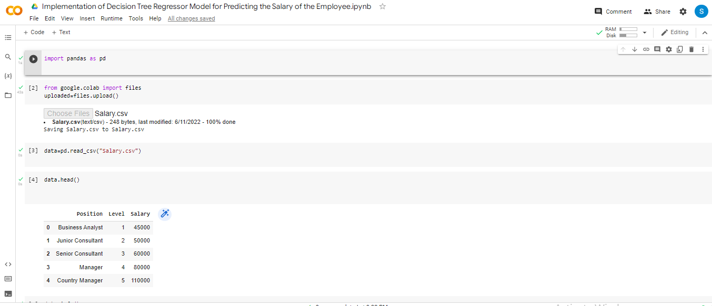
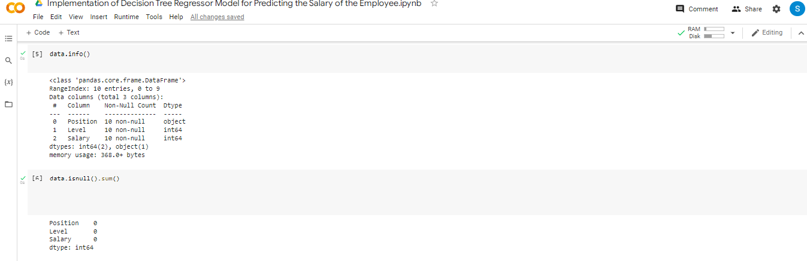
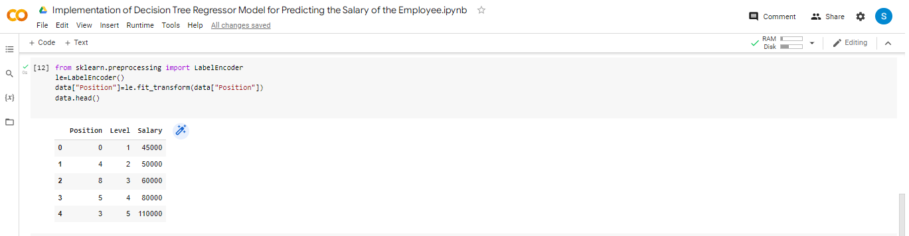
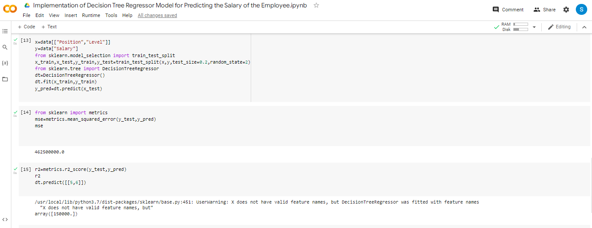

# Implementation-of-Decision-Tree-Regressor-Model-for-Predicting-the-Salary-of-the-Employee

## AIM:
To write a program to implement the Decision Tree Regressor Model for Predicting the Salary of the Employee.

## Equipments Required:
1. Hardware – PCs
2. Anaconda – Python 3.7 Installation / Moodle-Code Runner

## Algorithm
1. Import pandas as pd and import the required dataset.

2. Calculate the null values in the dataset.

3. Import the LabelEncoder from sklearn. preprocessing

4. Convert the string values to numeric values.

5. Import train_test_split from sklearn.model_selection.

6. Assign the train and test dataset.

7. Import DecisionTreeRegressor from sklearn.tree.

8. Import metrics from sklearn.metrics.

9. Calculate the MeanSquareError.

10. Apply the metrics to the dataset .

11. Predict the output for the required values.
## Program:
```
Program to implement the Decision Tree Regressor Model for Predicting the Salary of the Employee.
Developed by: Silambarasan K
RegisterNumber: 212221230101 

import pandas as pd
data=pd.read_csv("Salary.csv")
data.head()
data.info()
data.isnull().sum()
from sklearn.preprocessing import LabelEncoder
le=LabelEncoder()
data["Position"]=le.fit_transform(data["Position"])

data.head()
x=data[["Position","Level"]]
y=data["Salary"]
from sklearn.model_selection import train_test_split
x_train,x_test,y_train,y_test=train_test_split(x,y,test_size=0.2,random_state=2)
from sklearn.tree import DecisionTreeRegressor
dt=DecisionTreeRegressor()
dt.fit(x_train,y_train)
y_pred=dt.predict(x_test)
from sklearn import metrics
mse=metrics.mean_squared_error(y_test,y_pred)
mse
r2=metrics.r2_score(y_test,y_pred)
r2
dt.predict([[5,6]])


```

## Output:








## Result:
Thus the program to implement the Decision Tree Regressor Model for Predicting the Salary of the Employee is written and verified using python programming.
